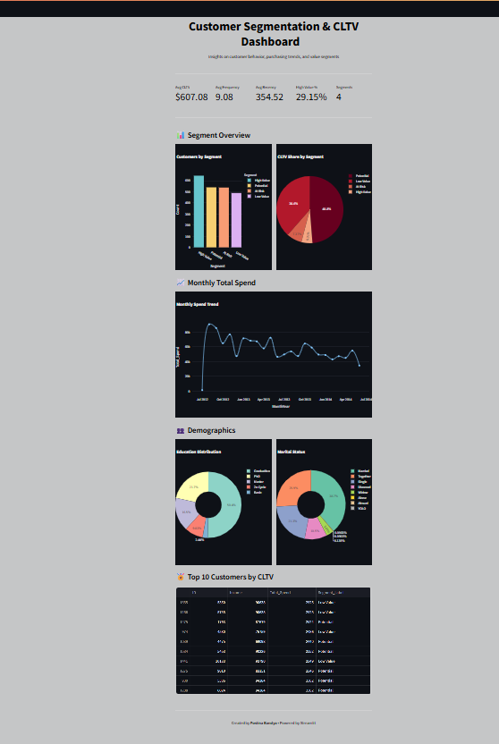

# 📊 Customer Segmentation & CLTV Prediction Dashboard

This project is a Streamlit-based dashboard that performs customer segmentation and predicts Customer Lifetime Value (CLTV) based on marketing campaign data. It provides actionable insights into customer behavior, purchasing patterns, and value segmentation.

---

## 🚀 Features

- RFM-based customer segmentation (Recency, Frequency, Monetary)
- CLTV prediction using machine learning
- Clean and responsive Streamlit dashboard
- Visualizations using Plotly and Pandas
- Custom segments: High Value, Low Value, Potential, At Risk
- Demographic and behavioral analysis

---

## 🛠️ Tech Stack

- Python
- Streamlit
- Pandas & NumPy
- Plotly
- Scikit-learn
- Jupyter Notebook (for model building)

---

## 📁 Project Structure
churn-project/
│
├── dashboard_app.py # Streamlit dashboard
├── data_cleaning.py # Data preprocessing
├── segmentation.py # RFM & clustering logic
├── predict_cltv.py # CLTV model predictions
├── final_segmentation.py # Merging segments & predictions
├── .gitignore
└── README.md

